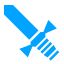
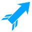

# Estee Kit

This library is a collection of utility classes I use in my godot gamedev projects.
Most of them are component classes used for composition in a more complex scene. They are intended to be combined in interesting ways to produce common game scenarios.

## Attack

This component represents the data from a single "attack" performed on a `HealthComponent`. It contains the abstractions for the attack metadata.

## AttackComponent

This is an Area3D that will send `Attack`s to `HealthComponent`s.

The general concept is that these are enabled/disabled during an "attack phase" and they do damage to any health component at a cooldown rate that they collide with.

## HealthComponent

This is a CollisionShape that can be attached to a body or area that represents the "hit box". It manages the notion of being "damaged" by an "attack" and works with the `AttackComponent`.

## InventoryComponent

This class manages an inventory. It works with `Item` and uses reparenting to control what an object belongs to. Inventories may be "open" or "closed", but what that means is an abstraction left to derrived classes.

It also has a notion of positional information for each item in the inventory. This can be used to lay out items when the inventory is "open". It also supports the notion of a "selected" item.

Derived classes can use this to do things like place items on shelves, in chests, or in a menu for selecting objects.

When something is "dropped" from the inventory, it is added back to the top level world and the physics for the `Item` is renabled.

## Item

A class that represents some sort of physical object the user can pick-up, throw, drop, or use. Items are RigidBodies that live in the world. They can be placed in `InventoryComponent`s, during which their physics are disabled so they can be manipulated.

Items have a usage cooldown, and various types. A special type, `Item.Type.UNARMED` represents "intagable" objects like fists, or feet. There are also projectiles, accessories, and several types of melee weapons.

`Weapon` and `Projectile` mechanics are covered in a subclass of `Item`.

## ItemSlot

Items have a notion of a "Handle" which is a marker location they are intended to be held by. There is also a relationship between item type and what `ItemSlot` it is can be attached to. In this way, custom hand positions for carrying, throwing, fighting, can be assigned to items independant of their resting origin. If a handle is missing, the origin will be used.

## Weapon

A specialization of `Item` that has an `AttackComponent` and an optional `Projectile` that it can launch. It can also trigger an `Effect` on `attack_start`. The `AttackComponent` contains the `Attack` metadata for determing strength, knockback, cooldown, etc.

Projectiles are `fire()`ed from an optional `launch_point` Marker, or from the weapon origin.

## Projectile

A specialization of `Weapon`. Projectiles are weapons which are fired, and optionally embed or bounce against objects they hit. After hitting something they will expire after a delay.

They have optional effects for both the "hit" and the "expire" phase of their lifetime.

## ProjectileLauncher

A utility class for stand-alone projectile firing. Can be combined with `TriggerComponent` to make things like arrow traps. Launches in a fixed direction.

## Effect

A utility class that represents a special effect. Effects are often either GPUParticles, or AnimationPlayers, or a combination of both. This class is intended to hold child objects which compose the effects. For simple particle effects it is just a pass through for one_shot and is_playing. For complex composit effects, those same calls will trigger an `AnimationPlayer`. In this way, the user doesn't need to distinguish between complex and simple effects in the calling code.

Used by `Weapon` and `Projectile`

## TriggerComponent

This is an Area3D that can be triggered by enemies or the player and operates with an optional cooldown and delay. It can be used to make traps by mixing it with `AttackComponent`.